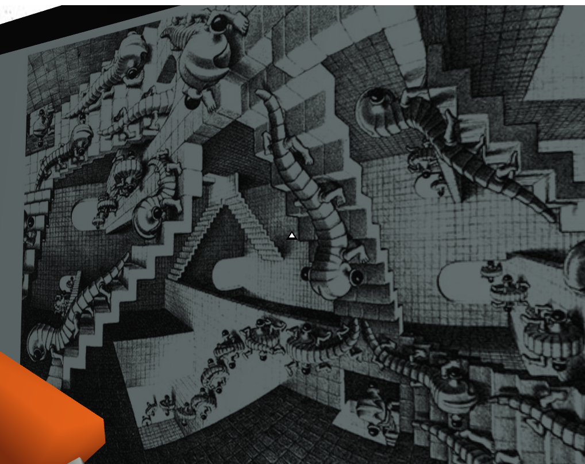
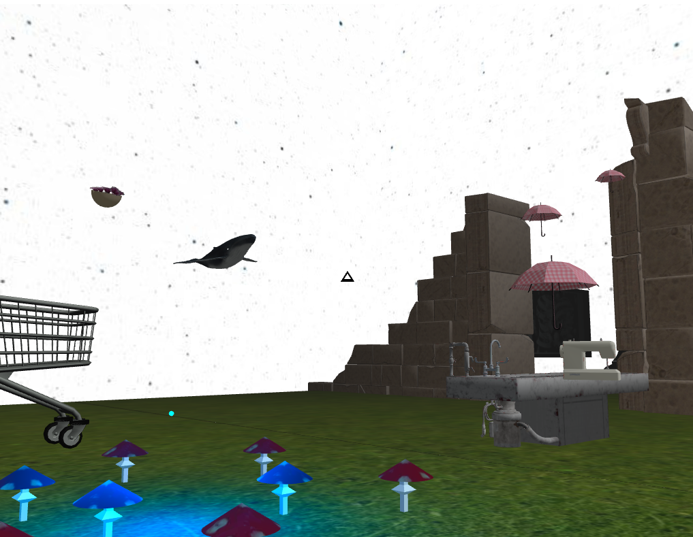
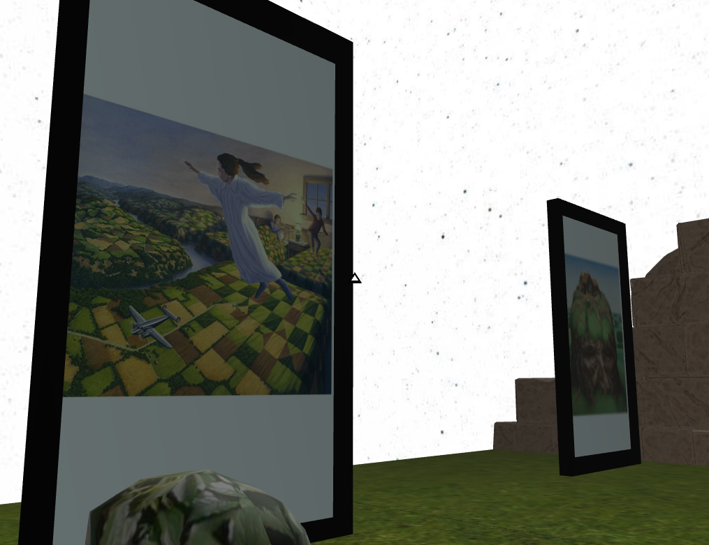

# Surreal museum

Semestral work for OpenGL graphics course.

  
  
  

## Technical point of view

> Note that his project is not trivial to run and is kept for archivation purposes.

- GLUT OpenGL project
- only works with [pgr-framework](https://cent.felk.cvut.cz/courses/PGR/framework/doc/) set up

## Artistic intend and final result

> The aim was to create an illusionary world that can be explored while riding shopping cart. Person should have an option to interact with dream objects appearing in that world.

*Interactive features*:
- pictures - can be scaled up,
- autopsy table - change in an umbrella and sewing table flight direction,
- bush - spawn more umbrellas. 

*References exmplanation*:
- sperm whale and a bowl of petunias - Hitchhiker's Guide to the Galaxy,
- random encounter of a sewing machine and an umbrella on an autopsy table - André Breton.

*Authors of pictures:*
- M. C. Escher,
- Rob Gonsalves,
- Jacek Yerka.
